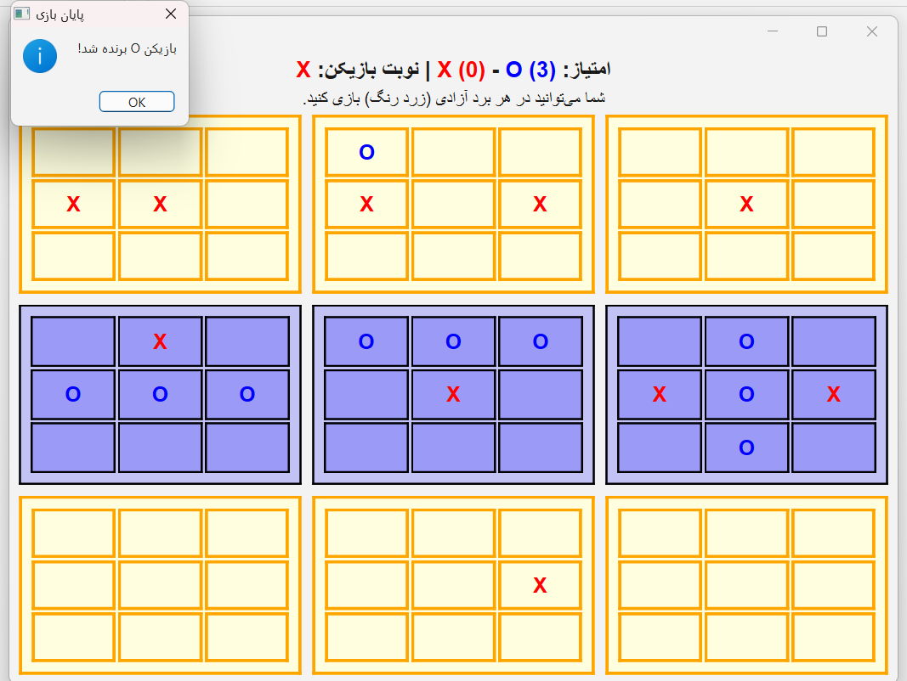

# Ultimate Tic-Tac-Toe — Qt6 / Modern C++17


A modular and scalable **Ultimate Tic-Tac-Toe desktop application** developed using **Modern C++17** and the **Qt6 Framework**.  
The project is designed with a strong focus on **object-oriented architecture**, **event-driven GUI development**, and **clean separation between game logic and presentation layers**.

This repository serves both as a complete playable game and as a demonstration of professional Qt application structure suitable for academic portfolios and software engineering showcases.

---

## ✨ Key Features

- 🎮 **Interactive Graphical User Interface** built with Qt Widgets
- 🧠 **Complete Ultimate Tic-Tac-Toe rule implementation**
- ✅ **Strict move validation** and active-board enforcement
- 🌈 **Visual highlighting** of the currently active local board
- 🔄 **Real-time game state updates** using Qt signals and slots
- 🧩 **Decoupled architecture** separating engine and UI
- ♻️ **Restart / reset functionality**
- 🖥️ Cross-platform Qt application (Windows, Linux, macOS)

---

## 🧠 Software Architecture

The codebase is organized with maintainability and extensibility in mind.

### `GameLogic`
Pure C++ game engine responsible for:

- board state management
- move validation
- local and global win detection
- turn management
- draw detection

### `GameWidget`
Qt-based presentation layer responsible for:

- rendering the 9×9 board
- handling user interactions
- updating button states
- communicating with the game engine through signals and slots

### `MainWindow`
Application controller responsible for:

- main window management
- menu navigation
- scene switching
- application flow

This separation allows the game engine to remain independent from the graphical interface, making future testing and feature expansion significantly easier.

---

## 🛠️ Technologies Used

- **C++17**
- **Qt 6 (Qt Widgets)**
- **CMake**
- **MinGW 64-bit** (development environment)

---

## 📁 Project Structure

```text
UltimateTicTacToe-Qt6-Cpp/
├── CMakeLists.txt
├── main.cpp
├── mainwindow.h
├── mainwindow.cpp
├── mainwindow.ui
├── .gitignore
├── README.md
└── screenshots/
```

---

## 🚀 Build and Run

### Prerequisites

- Qt 6.9 or newer
- CMake 3.16+
- A C++17 compatible compiler

### Build with Qt Creator

1. Open `CMakeLists.txt`
2. Select your Qt 6 kit
3. Configure the project
4. Build and run

### Build from Command Line

```bash
mkdir build
cd build
cmake ..
cmake --build .
```

---

## 📸 Screenshots

Add screenshots to make the repository visually attractive.

```text
screenshots/
└── gameplay.png
```

Then uncomment the following lines:

```markdown

```

---

## 🎯 Educational Objectives

This project was created to practice and demonstrate:

- object-oriented programming
- Qt Widgets development
- event-driven programming
- GUI architecture
- signals and slots
- CMake-based project organization
- version control with Git and GitHub

---

## 🔮 Possible Future Improvements

- 🤖 AI opponent (Minimax / Alpha-Beta)
- 🌐 Online multiplayer
- 🎨 Theme system (Dark / Light)
- 💾 Save and load game states
- 📊 Match statistics and history
- 🧪 Unit tests for the game engine

---

## 🤝 Contributing

Contributions, issues, and feature requests are welcome.

If you would like to improve the project, feel free to:

- open an issue
- submit a pull request
- suggest new features

---

## 👨‍💻 Author

**Mohammad Reza Afraz**

Electrical Engineering (Communications) Student — Iran University of Science and Technology (IUST)

---

## 📬 Contact

📧 **Email:** [afrazm48@gmail.com](mailto:afrazm48@gmail.com)

💬 **Telegram:** [@MmdReza_Afraz](https://t.me/MmdReza_Afraz)

📷 **Instagram:** [@afraz.mohammadreza](https://instagram.com/afraz.mohammadreza)

🌐 **GitHub:** [MohammadrezaAfraz](https://github.com/MohammadrezaAfraz)

